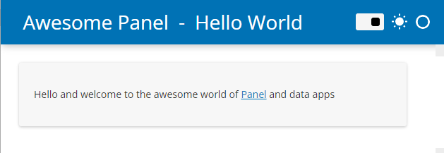
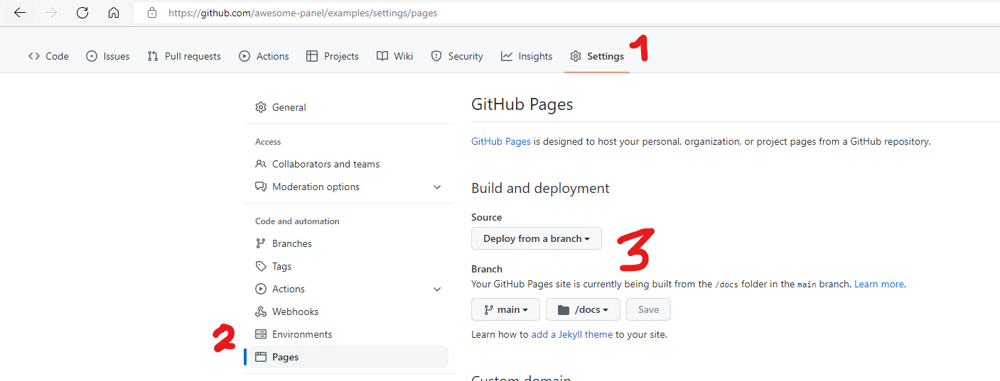

# ✨ Awesome Panel Examples

A repository of Awesome Panel data app examples.

The source files are available in the [src](/src) folder.

The apps are converted to webassembly and released to
[awesome-panel.github.io/examples](awesome-panel.github.io/examples) as simple as

1. `$ panel convert app.py` (1 second)
2. `$ git push` (1 second)

This is **THE FASTEST WAY TO DEPLOY DATA APPS** in Python.

The apps are very performant when loaded because there is no latency for communication between
server and client. BUT the apps take time to load as they need to download
a Python runtime and additional packages (50MB per app).

This is **THE FUTURE OF DATAVIZ** in Python.

If you like Panel and Awesome Panel please support the projects by giving them a ⭐ on Github

[⭐ holoviz/panel](https://github.com/holoviz/panel) [⭐ awesome-panel/awesome-panel](https://github.com/awesome-panel/awesome-panel) [⭐ awesome-panel/examples](https://github.com/awesome-panel/examples)

Thanks 👍

## 📙 How to

### ⚙️ Install the repository

```bash
git clone https://github.com/awesome-panel/examples.git
```

Create and activate a virtual environment, c.f.
[Python Virtual Environments: A Primer](https://realpython.com/python-virtual-environments-a-primer/).

Install the `requirements.txt` file

```bash
pip install -r requirements.txt -U
```

### 💻 Serve a server app locally

You can serve for example the [hello-world](src/hello-world/app.py) application on your Panel server via

```python
panel serve src/hello-world/app.py --autoreload
```

It will be available at [http://localhost:5006/app](http://localhost:5006/app).



### 🏗️ Convert an app to webassembly

You can [panel convert](https://panel.holoviz.org/user_guide/Running_in_Webassembly.html) for
example the [hello-world](src/hello-world/app.py) application to webassembly via

```python
panel convert src/hello-world/app.py --to pyodide-worker --out docs/hello-world
```

### 💻 Serve a webassembly app locally

```bash
python3 -m http.server
```

The app is now available at [http://localhost:8000/docs/hello-world/app.html](http://localhost:8000/docs/hello-world/app.html)

### ⚙️ Configure the repository for Github Pages

You can learn how to configure Github Pages in general via the [Quickstart for Github Pages](https://docs.github.com/en/pages/quickstart).

The Github Pages of [awesome-panel/examples] is configured as described below

1. Make sure the repository contains a `.nojekyll` file and is pushed and up to date.
2. Navigate to the *Settings* page
3. Navigate to the *Pages* page
4. Configure your Pages Settings as shown below



## 🔥 Release to Github Pages

Git `add`, `commit` and `push` as you would normally do.

After a little bit of time the applications should be available at [awesome-panel.github.io/examples](awesome-panel.github.io/examples) or similar.
